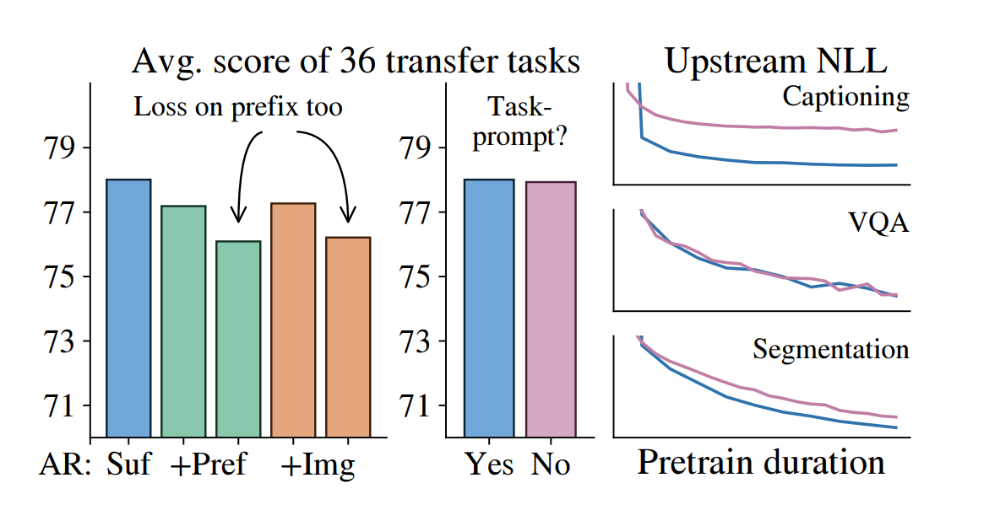
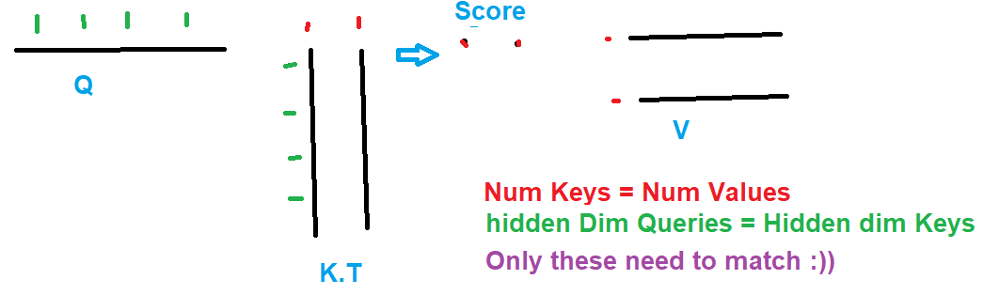

# PaliGemma

Following along with the one and only Umar Jamil: [https://www.youtube.com/watch?v=vAmKB7iPkWw](https://www.youtube.com/watch?v=vAmKB7iPkWw)
Umar's Github repo : [https://github.com/hkproj/pytorch-paligemma](https://github.com/hkproj/pytorch-paligemma)

## Notes

### Vision Encoder model

- Why do we use contrastive learning when training VMs? :
  - Because we not only want our model to learn good representations for the images/text, but also to have it learn some mutual representation between the two.
  - There's also the fact of data availibility (so many pairs of images that have text asociated with them).
    - side note: internet is noisy, but scale can help with that.
- What was the motivation behind using siglip as loss function:
  - The softmax was computationnal heavy, we had a matrix that results from the dot product of shape N by N, we needed to do:
    - Row wise softmax.
    - AND Column wise softmax, because there's no symetry we can benifit from (dot a times b != dot b times a).
- What are the steps that an image goes in order to be encoded in a vision transformer? :
  - We first need to partition/split the image into patches say 16 by 16 pixels.
  - We apply convolution operations on the patches to get a shared represention.
  - We flatten the patches to have one vector (1LP?) and the we concat them.
  - We add learned(-ed+able) positionnal information to give a signal about the order.
- Why do we have a config file for the model? :
  - PaliGemma comes in different sizes.
- Why do we use `register_buffer`?
  - The tensors get moved to the device when the model does.
  - The are not included in model.parameters (is even better than setting param.`requires_grad` to `False`, because the optimzer doesn't iter over them! flipping cool!)
  - It can also be included in the state_dict, except if `persistent` is set to `False`.
- Why do we need positionnal embeddings?
  - It relates to how the positionnal information is lost because the attention scores (from att mech) are invarient to the positions, thus we need a signal to fix this. (note: RNNs like model do not have this problem)
- What is internal coavariate shift?
  - I understand it as follows: during training the input statistics of a batch (mean, var) can change drastically (ex: pics of a desert vs of a sea), this leads to a drastic change in the activations, thus the gradient will vary a lot thus the loss too, hence the gradients too, this seems not to be good proprety for learning.
- How does batch norm work? and how does it attempt to fix? what are its limitations?
  - It work by tracking the statistics at the batch level (bsz, hidden_dim -> 1, hidden_dim).
  - By tracking these metrics (mean, var) we can keep a normal distrubtion of the batch activations, and thus have stable gradients
  - The limitations have to do with batch size, it works better with a bigger batch size, because the statistics are more representative.
- How does layer norm avoid the falls of batch norm?
  - It does so by calculating the stats at the input level (bsz, hidden_dim -> bsz, 1), it's thus independent of the batch size
- How does applying a Linear layer differ from attention?
  - Linear layear work on feature level, and do not exchange information between hidden states (the goal is the extend the feature space to an intermediate state, apply a non linearity and and apply some transformation in that expanded space while going to the inital input state).
- Why is the GeLu used rather than ReLu?
  - A major problem when using ReLu is that when the inputs are smaller than 0, they get flattened out thus losing some of the information (gradient is 0), GeLu smooths that part (some kind of fancy Leaky ReLu)
- What's the point of using the multihead attention?
  - The idea comes from the fact that word (tokens) can have multiple meanining, we thus want to facilitate having platera by allowing local interaction (ex: Q:[seq_len:4, head:1, head_dim:128] allows only interactactions withing the first 128 dims of each tokens (when multiplied with K.T)).
  - It's also a great way to parallelize the computations, as each head is independent of the others.
- Why do we need to use `.contiguous` after the `transpose`?
  - The memory layout remains the same and thus the values in each dim are not contiguous, and using `view` requires the layout to be contigous (follow row major style of Pytorch), `.contiguous`  recreates a tensor with a contiguous memory which values follow that of the transpose.
- What's the point of Multiplying by W_O after calculating `Concat(Softmax(Q*K.T/sqrt(hidden_dim))*V, dim=-1)`?
  - The goal is to enable the exchange of informations between the heads (some kind of mixing layer).

### Processor

- What are the <loc[value]> tokens about ?
  - They are used to predict a bounding box for an object (i.e 4 tokens are predicted for each object (y_min, x_min, y_max, x_max)), it's trigered by a prompt of the following structure: dectect [object].
- How do we get the actual position ?
  - the value is in range(1024): We need to first devide the numbers by 1024, then multiply by height/width to get x/y.
- What are the <seg[value]> tokens about ?
  - They are use as base to reconstruct a segmentation mask.
- What's the idea behind it?
  - The sequence consists of 16 tokens of these kind, they are used as codebook, to identify a mask, these are fed to Vector-Quantized VAE, which handles the reconstructions [check out the code here](https://huggingface.co/spaces/big-vision/paligemma/blob/main/paligemma_parse.py)
- What's the point of the `IMAGE_TOKEN`?
  - A number of patches of this token will be substituted by the embedding of the image generated by the siglip vision model.
- Why do we rescale the images?
  - Because the inputs need to have the same shape (to end up with same number of 16*16 patches as how it was trained)
- What's the order in which the sequences is fed (images, promptm bos)?
  - `IMAGE_TOKEN`s,`<bos>`,`<prompt>` and finnaly `\n`
- Why do we use `\n`?
  - It's used and eos token, because it's not included in the prefix sequences.

### Gemma Model

- In the KV cache, what are the two phases and are their objectives?
  - A prefill phase, where we generate the Keys and Values of the images + prompt
  - A Generation phase, we we add one key and one query at a time.
- Explain what's the point of this line `kv_len = kv_cache.num_items() + q_len` ?
  - The idea is to increment the dim by 1, so we can use this value for generating the causal mask.
- Why is there Full Attention between the prefix and images?
  - according to the article: The motivation is that it allows more tokens to actively participate in the “thinking” process from the start

The blue is for the scores on downstream task we get from following the proposed approache, other are experiments with ARegressivness on different levels

- What's the point of `PaliGemmaMultiModalProjector`?
  - The goal is to have the same embedding dim for the images and text (for future cat), so as to enable the attention mech to work.
- Why does one use `padding_idx` in  `nn.embedding`:
  - This makes the values be init to 0
  - This disallows the contribution to the gradients (not updated)
- Why was RMSnorm introduced?
  - It made the hypothesis that models don't need mean 0 inputs, and that actually the important element is them having close to 1 variance.
  - *And* It also needs one less metric to compute (mean)
- What's the point of this in RMSnorm `output = output * (1.0 + self.weight.float())`?
  - THe scaling start as vanilla RMSnorm (as weights are init to 0), then it learns to deviate from this during training.
- Explain the point of this `self.down_proj(nn.functional.gelu(self.gate_proj(x), approximate="tanh") * self.up_proj(x))`
  - A gating mechansim: Where a projection to a higher dim is done, at that level a selection happens with the element wise matrix muliplication, and then back to the original dim.
- Why was multiquery attention (MQA) proposed?
  - The essence is about reducing data transfer, if we have have only 1 keys (extreme case) we can manage to transfer it to high speed memory (SRAM) once and keep it there, we can then re-use it num queries times. The same idea goes for having 1 value matrix. 
  - If take this idea and instead use a group of (K,V), and use the same strategy to use redundancy as much as possible we get Grouped Query attention (GQA)!
  - Bonus thing you get: Reduced KV cache size!
  

### Rotary positionnal embedding

That part was is just a streight up copy paste from Umar Jamil's repo, with a slight regarding the comment of the equation of theta which should be theta_i = base^(-2i/dim) where i = 0, 1, 2, ..., dim // 2.

The reason is that the implmentation 'does not follow the' the original paper, because it's a port from HuggingFace, which itself is a port to be able to use weights of released pretrained models, and somewhere in the way they had to make some permutations of the dims...Doesn't matter.

The idea of ROPE is pretty streight forward, rotate the embeddings of Q, and K by an angle tetha, the resulting dot product will be  a function of the postition of the tokens in a sequence: Attention scores will be decaying as the relative distance between tokens grow.

I would really recommend reading this [blog](https://fleetwood.dev/posts/you-could-have-designed-SOTA-positional-encoding  ) by an ml engineer at HF, which itself include some pretty neat references
